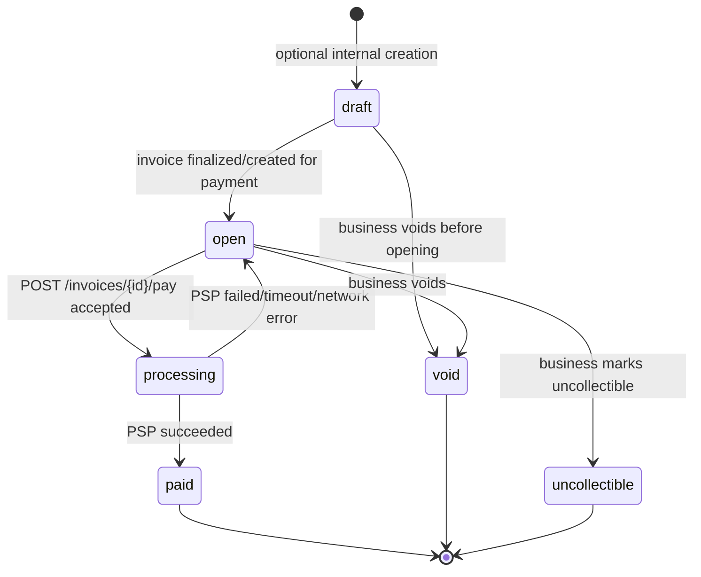

# DESIGN.md

## 1. Data Model

### Tables and purpose

- `businesses`: tenant root.
- `api_keys`: business-scoped API credentials (prefix + hash + revocation).
- `customers`: business-scoped customer records.
- `invoices`: business-scoped invoice header, state, total cents, due date.
- `invoice_line_items`: invoice lines used to compute invoice total.
- `payment_attempts`: each pay call attempt, with idempotency key and PSP outcome.
- `webhook_endpoints`: destination URLs per business with signing secret.
- `webhook_events`: event outbox rows (`invoice.created`, `invoice.paid`, `invoice.payment_failed`).
- `webhook_deliveries`: per-endpoint delivery jobs with retry metadata.

### Domain shape

- `businesses` has many `customers`
- `businesses` has many `invoices`
- `customers` has many `invoices`
- `invoices` has many `payment_attempts`
- `businesses` has many `webhook_endpoints`
- `webhook_events` fan out into `webhook_deliveries`

### Primary key strategy

- UUID primary keys for all main entities.
- Reason: simple distributed-safe id generation in app layer and stable external references.

### Indexes (implemented)

- `api_keys(business_id)`, `api_keys(key_prefix)`
- `customers(business_id)` and unique `(business_id, email)`
- `invoices(business_id)`, `invoices(customer_id)`, `invoices(state)`
- `invoice_line_items(invoice_id)`
- `payment_attempts(business_id)`, `payment_attempts(invoice_id)`, `payment_attempts(idempotency_key)`, unique `(business_id, idempotency_key)`
- `webhook_endpoints(business_id)`
- `webhook_events(business_id)`, `webhook_events(event_type)`
- `webhook_deliveries(event_id)`, `webhook_deliveries(endpoint_id)`, `webhook_deliveries(next_attempt_at)`

### Why this shape

- Keeps strict tenant isolation by carrying `business_id` through all business-owned records.
- Separates outbox (`webhook_events`) from delivery execution (`webhook_deliveries`) so webhook sending is async, recorded and retriable.
- Keeps payment correctness in one row per idempotency key per business via unique constraint.

### 100x Scale Changes

- Introduce Redis-based caching for frequently accessed read paths such as invoice retrieval and customer lookups to reduce repeated database reads.

- Add PostgreSQL read replicas for read-heavy list and reporting endpoints while keeping payment mutations on the primary database.

- Partition high-write tables such as `payment_attempts`, `webhook_events`, and `webhook_deliveries` by time (e.g. monthly partitions) to improve index efficiency and long-term query performance.

- Add targeted indexes such as a partial index on `webhook_deliveries(status, next_attempt_at)` to optimize polling for pending webhook retries.

- Replace DB-backed polling workers with a dedicated queueing system (Kafka / RabbitMQ / Redis Streams) once webhook throughput and asynchronous job volume outgrow a database-driven approach.

---

## 2. Invoice State Machine

### Terminal states

- `paid`, `void`, `uncollectible`

### Valid transitions implemented/defined (controlled via `validate_transition()`)

- `draft -> open`
- `draft -> void`
- `open -> processing`
- `processing -> paid`
- `processing -> open`
- `open -> void`
- `open -> uncollectible`

### Reversibility

- Reversible: `processing -> open` (on PSP failure path)
- Not reversible: transitions into terminal states.

### Invalid transition handling

- Invalid transitions are rejected in API logic with `409` and code `invalid_state_transition`.

---

## 3. Payment Correctness & Failure Modes

### Concurrency mechanism

- **Chosen mechanism:** row-level lock (`SELECT ... FOR UPDATE`) in a transaction, combined with idempotency uniqueness and state-transition guards.
- DB transaction + `SELECT ... FOR UPDATE` row lock on the invoice.
- Unique constraint on `(business_id, idempotency_key)` in `payment_attempts`.
- Transient invoice state `processing` prevents concurrent different-key charges.

### Why this over alternatives

- **Advisory lock:** would work, but adds separate lock-key design and operational complexity; row lock naturally scopes to the invoice row itself.
- **Optimistic concurrency only:** under same-invoice simultaneous pay calls, optimistic checks can cause repeated retries/conflicts; row lock gives deterministic single-writer behavior.
- **Serializable isolation as primary control:** stronger but heavier and can increase transaction abort/retry rates; targeted row lock protects the exact hot row with simpler behavior.
- **Status-conditional update only:** checking state without lock is race-prone when two requests read `open` concurrently; row lock closes this race explicitly.

### (a) Two clients call `POST /invoices/{id}/pay` at the same instant

- First request acquires invoice lock, creates attempt, transitions `open -> processing`, commits.
- Second request eventually reads invoice as `processing` and is rejected as non-payable.
- Outcome: at most one PSP call starts for that invoice at that instant.

### (b) PSP times out (`tok_timeout`, 30s)

- Invoice service HTTP client has short timeout; endpoint does not hang for 30s.
- Attempt becomes `failed` with `failure_code = psp_timeout`.
- Invoice transitions `processing -> open` (recoverable, not stuck).
- Caller learns result from response body (`status: failed`, `failure_code: psp_timeout`) and can retry with new idempotency key.

### (c) PSP succeeds but service crashes before persisting success

- Current implementation calls PSP before finalization transaction.
- If crash happens after PSP success but before DB update, DB may still show processing/open depending on crash point.
- Retry with same idempotency key returns existing attempt row if present; if attempt finalization was not stored, this is a gap.
- This is explicitly a production-readiness gap; robust fix is PSP-side idempotency key + reconciliation workflow before accepting next charge.

### (d) Idempotency key reused with different request body

- If same key is used with different `invoice_id` or `card_token`, API returns `409` `idempotency_conflict`.

### (e) Invoice in `paid` receives another `POST /pay`

- Rejected with `409` (`invoice_not_payable`) because `paid` is terminal.

---

## 4. Webhook Design

### Signing scheme

- Algorithm: HMAC-SHA256.
- Secret: per-endpoint `signing_secret` in `webhook_endpoints`.
- Signed string: `<timestamp>.<event_id>.<payload_json>`.
- Headers sent:
  - `X-Dodo-Event-Type`
  - `X-Dodo-Event-Id`
  - `X-Dodo-Timestamp`
  - `X-Dodo-Signature`

### Replay protection

- Receiver-side verification expected: validate signature and reject stale timestamps.
- Producer includes timestamp and event id; consumer policy is documented expectation.

### Retry policy (implemented)

- Attempt 1 retry after 5s
- Attempt 2 retry after 30s
- Attempt 3 retry after 120s
- Attempt 4 retry after 600s
- Attempt 5 exhausted

### Exhausted handling

- If all retries fail, we stop retrying and mark that delivery as `exhausted`.
- We also store the last error and HTTP status so it is easy to debug what failed.

### Reconciliation for missed events

- If a business thinks it missed an event, it can compare its records with our event IDs and invoice IDs.
- The `exhausted` rows show which deliveries failed permanently and are the place to build manual replay tooling later.

### Why decoupled from API path

- API writes outbox rows (`webhook_events` + `webhook_deliveries`) in DB transaction and returns.
- Background worker performs network delivery and retries.
- This removes webhook endpoint latency/failure from customer-facing API response latency.

---

## 5. API Key Model

### Generation

- For local/dev: deterministic seeded key.
- For real issuance: generate high-entropy random key and show once.

### Storage

- Store `key_hash` (SHA-256 of raw key) and `key_prefix` for lookup.

### Transmission

- `Authorization: Bearer <api_key>` over HTTPS (assumed in real deployment).

### Rotation

- Create new key, switch clients, revoke old key (`revoked_at`).

### Revocation

- Middleware checks `revoked_at`; revoked keys are unauthorized.

### Blast radius if leaked

- Leak of one key compromises only the mapped business scope.
- Prefix+hash storage prevents DB read exposure from revealing raw keys.

---

## 6. What I Cut and Why

1. Refunds / partial payments

- I intentionally did not implement refunds or partial captures because they significantly increase payment-state complexity and reconciliation requirements. The assignment focuses primarily on correctness of invoice payment flows.

2. Multi-currency / FX

- Explicitly out of scope; kept USD-only cents path.

3. External queue (Redis/Rabbit/Kafka)

- I considered introducing an external message queue for webhook delivery and background processing, but chose not to because it would add significant operational complexity for limited benefit at this scale. A database-backed async delivery flow was sufficient for the assignment requirements.

4. Advanced rate limiting

- I did not implement production-grade rate limiting or bot protection. I would add them before production deployment.

---

## 7. Production Readiness Gaps

1. End-to-end payment reconciliation

- The current implementation treats PSP timeouts as failed payment attempts for simplicity. In reality, a timeout does not guarantee payment failure because the PSP may still process the charge successfully after the client timeout expires.

- A production-grade system would introduce reconciliation jobs to periodically verify `processing` / `pending` payment attempts against the PSP and repair inconsistent invoice states after crashes or network failures.

- This is especially important for crash windows where the PSP succeeds but the service crashes before persisting the success locally.

2. Observability and monitoring

- The service currently has only basic logging. A production deployment would require structured logs, metrics, dashboards, alerting, and error monitoring (e.g. Sentry) to debug payment failures and operational issues safely.

3. Operator tooling and recovery workflows

- The system currently lacks operational tooling for replaying exhausted webhooks, retrying failed deliveries, manually repairing stuck payment attempts, and investigating reconciliation mismatches. These admin workflows become important once real money movement is involved.
